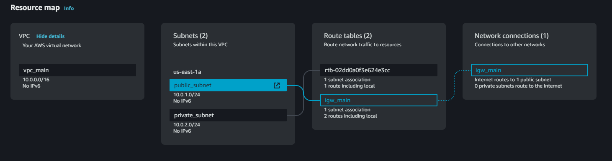

- [VPC Launch](#vpc-launch)
  - [VPC Components](#vpc-components)
  - [Terraform Modules](#terraform-modules)

# VPC Launch

> This repo insted to had a basic network infrastructure. The basical idea it´s have two Subnets, one public and other privated with an Internet gateway (_igw_) connected to the public one. And the routing table that permit 0.0.0.0/0 traffic between the public subnet and the igw.

An overview of what will be created on AWS onece execute the terraform manifiest.



## VPC Components

1. VPC (_10.0.0.0/16_)
2. Public Subnet (_10.0.1.0/24_)
3. Private Subnet (_10.0.2.0/24_)
4. Public Routing Table (_Public Subnet <-> 0.0.0.0/0_)

## Terraform Modules

```
\
│   main.tf
│   outputs.tf
│   variables.tf
│
├───img
│       vpc_map.png
│
└───modules
    ├───igw
    │       main.tf
    │       outputs.tf
    │       variables.tf
    │
    ├───routing_table
    │       main.tf
    │       outputs.tf
    │       variables.tf
    │
    ├───subnets
    │       main.tf
    │       output.tf
    │       variables.tf
    │
    └───vpc
            main.tf
            output.tf
            variables.tf
```
