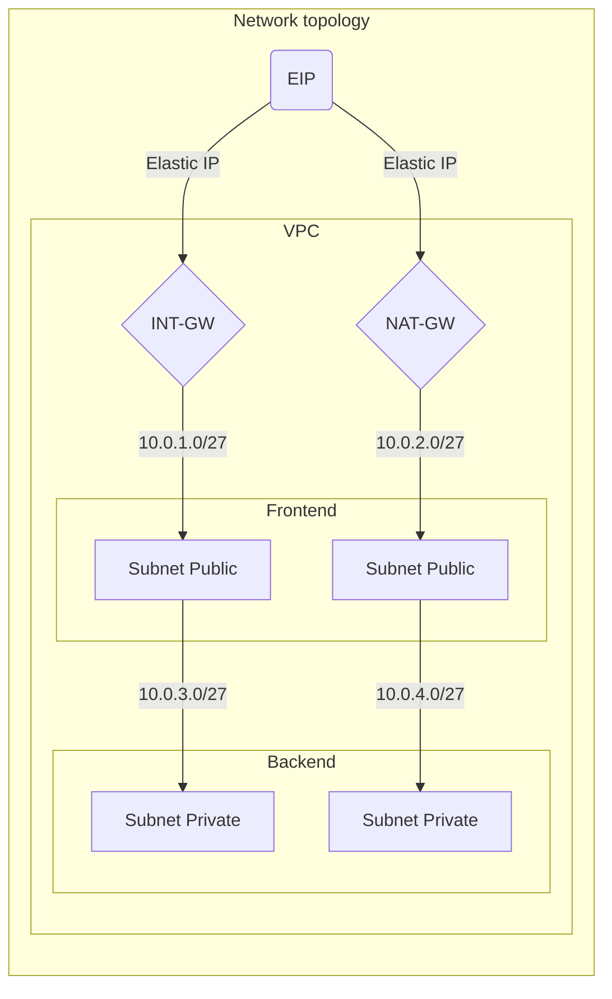

# Lauch VPC

> This folder insted to create a VPC with a basic structure for conduct test on AWS the idea is not create each time at hand the following structure.

```mermaid
flowchart LR
    subgraph Network topology
    Z(EIP) --> |Elastic IP|X
    Z(EIP) --> |Elastic IP|Y
    subgraph VPC
    X{INT-GW} --> |10.0.1.0/27| B
    Y{NAT-GW} --> |10.0.2.0/27| C
    subgraph Frontend
     B[Subnet Public]
     C[Subnet Public]
    end
    subgraph Backend
    B[Subnet Public] --> |10.0.3.0/27| E[Subnet Private] 
    C[Subnet Public] --> |10.0.4.0/27|D[Subnet Private] 
    end
    end
    end
```
