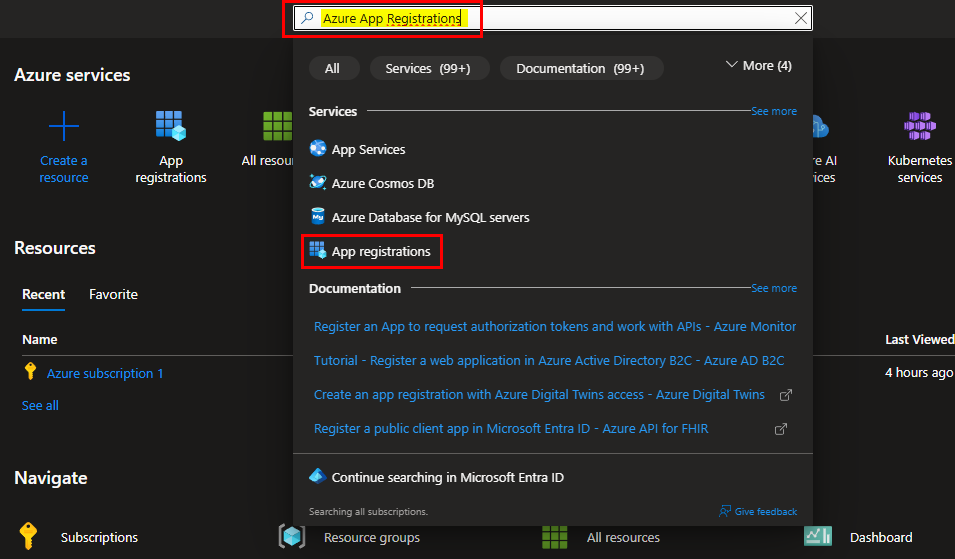
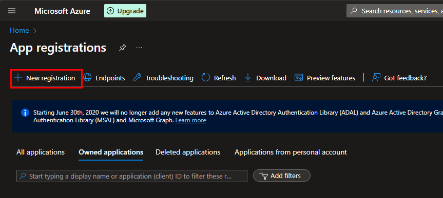
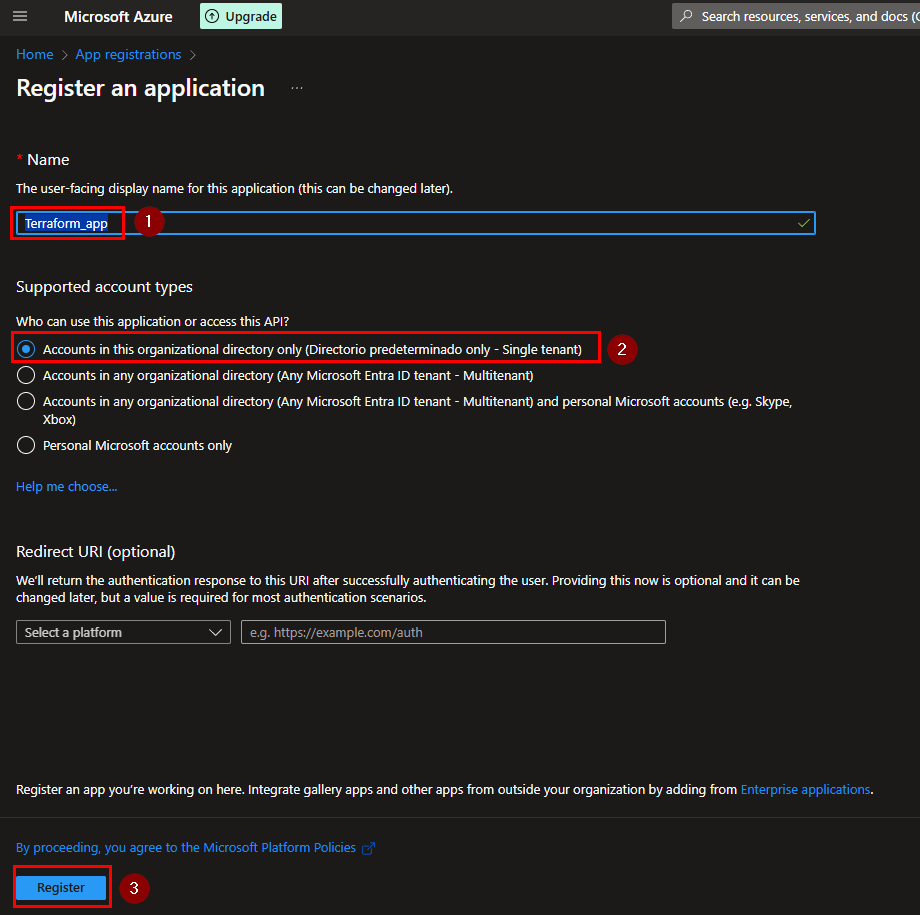
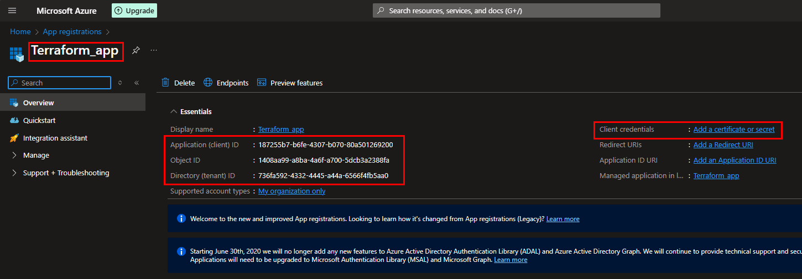
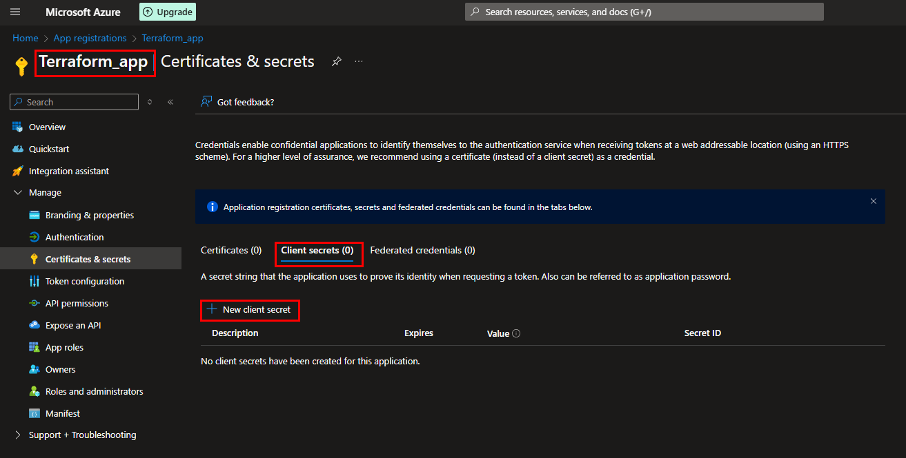
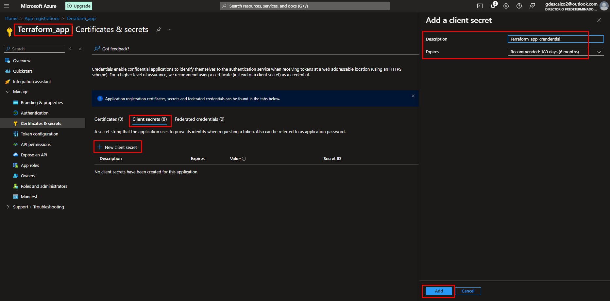
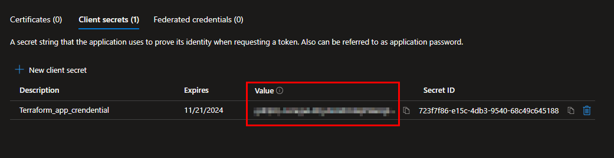
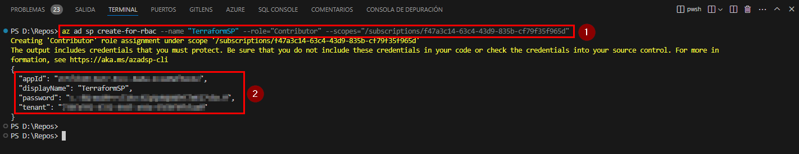

# Terraform repo for Azure

## How to consume

First is require to have an Azure account, a [trial](https://azure.microsoft.com/es-mx/free/search/?ef_id=_k_Cj0KCQjwmMayBhDuARIsAM9HM8cJQCaGc5d4sDgHU-RJIT3e2CJQNVuJiqtwjkgJBxYjcyKs-HGEFXEaAts0EALw_wcB_k_&OCID=AIDcmm8iiz2htt_SEM__k_Cj0KCQjwmMayBhDuARIsAM9HM8cJQCaGc5d4sDgHU-RJIT3e2CJQNVuJiqtwjkgJBxYjcyKs-HGEFXEaAts0EALw_wcB_k_&gad_source=1&gclid=Cj0KCQjwmMayBhDuARIsAM9HM8cJQCaGc5d4sDgHU-RJIT3e2CJQNVuJiqtwjkgJBxYjcyKs-HGEFXEaAts0EALw_wcB) will one is more will be more that enough for consume the different manifest on this repo.

Then as second step is necessary to authenticate in some way with Azure, the Terraform code write. Please find bellow how can be authenticate against Azure.

<hr />

## Requirements

Please found below the requirements for authenticate Terraform against Azure

- CLIENT_ID="your-appId"
- CLIENT_SECRET="your-password"
- TENANT_ID="your-tenant"
- SUBSCRIPTION_ID="your-subscription-id"

<hr />

## Authentication Alternatives

Below figured some authentication alternatives:

<details>
<summary><b>App registration</b> (<i>click to expand</i>)</summary>

> Once you already have access to your account it´s necessary dive on Azure portal and search by "App Registrations"

| Step 1 | Step 2 |
| :-: | :-: |
|  |   |

> Then you will have to create an App Registration, click on Register an application and then follow the instructions



> After that we will have created our application and that will provide part of the necessary information to authenticate against Azure:

| Information Required | Capture |
| - | :-: |
| - subscription_id <br /> - client_id <br />- tenant_id |  |

> It´s valid to clarify that for each App Registration made is required to create a **Client Credential** where figured "**Add a certificate or secret**" (_check the below screenshot_)

| Step 1 | Step 2 |
| :-: | :-: |
|  |  |

> This action will give us the last information required



</details>
<details>
<summary><b>Service Principal</b> (<i>click to expand</i>)</summary>

**Create a Service Principal**

1. Download [Azure CLI](https://learn.microsoft.com/en-us/cli/azure/install-azure-cli)

1. Login Azure CLI

    ```
    az login
    ```

1. Create Service Principal execution the following command:

    ```
    az ad sp create-for-rbac --name "<service-principal-name>" --role="Contributor" --scopes="/subscriptions/<subscription-id>"
    ```

    > _This command will output the necessary information (appId, tenant, password)._

    

</details>
