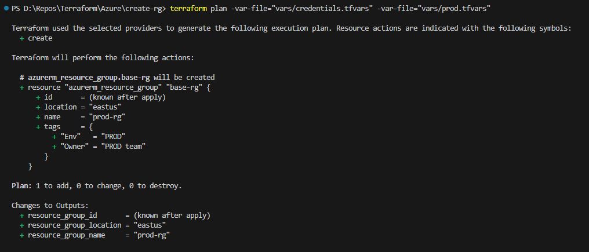
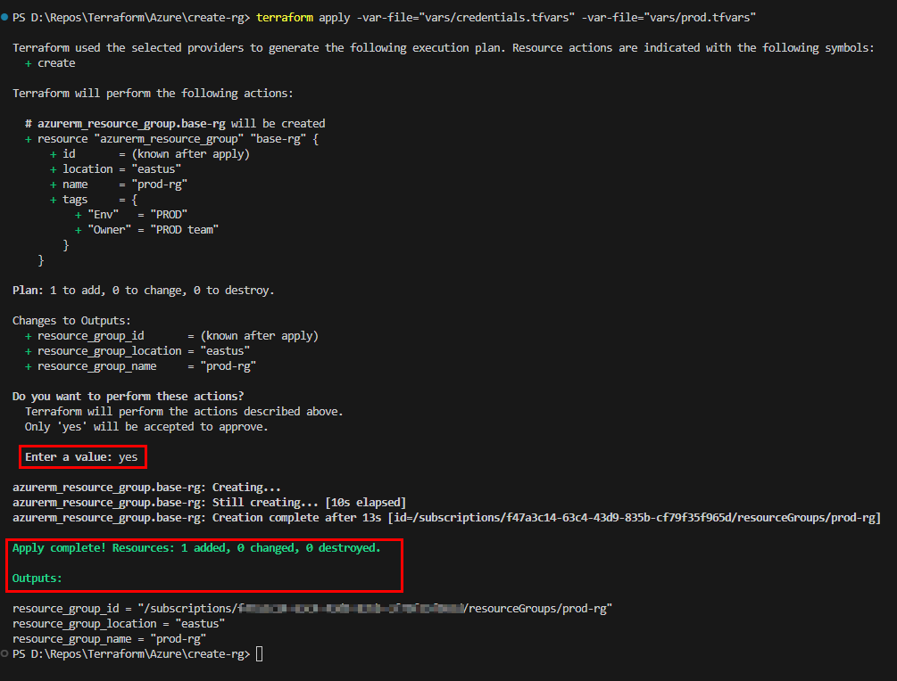
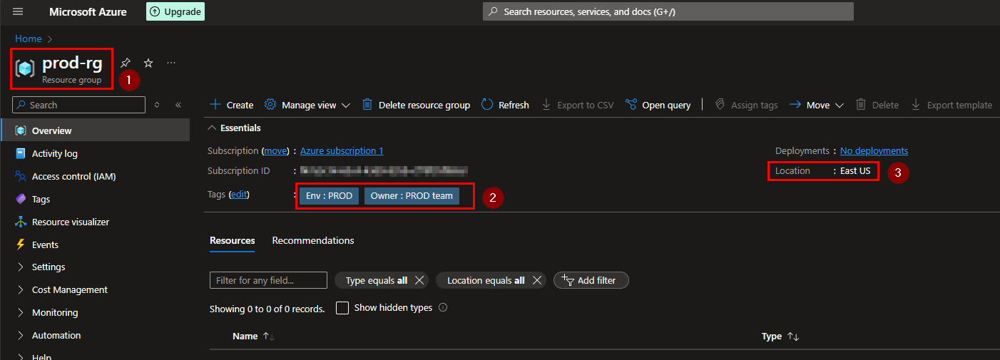

# Terraform Azure Resource Group Deployment

This project demonstrates how to use Terraform to create an Azure Resource Group. The configuration is set up to use environment-specific variable files and securely manage credentials.

## Project Structure

your-terraform-project/
├── create-rg/
│ ├── main.tf
│ ├── outputs.tf
│ ├── README.md
│ ├── variables.tf
│ ├── .terraform/
│ ├── img/
│ └── vars/
│ ├── credentials.tfvars
│ ├── dev.tfvars
│ ├── prod.tfvars
│ └── qa.tfvars
└── ...

## Prerequisites

- [Terraform](https://www.terraform.io/downloads.html) installed
- [Azure CLI](https://docs.microsoft.com/en-us/cli/azure/install-azure-cli) installed
- Azure subscription

## Setup

1. **Update `credentials.tfvars`**:

    Add the service principal credentials to `vars/credentials.tfvars`:

    ```hcl
    client_id       = "YOUR_APP_ID"
    client_secret   = "YOUR_CLIENT_SECRET"
    tenant_id       = "YOUR_TENANT_ID"
    subscription_id = "YOUR_SUBSCRIPTION_ID"
    ```

2. **Configure Environment Variables**:

    Update the environment-specific variable files (e.g., `vars/prod.tfvars`):

    ```hcl
    environment         = "prod"
    location            = "East US"
    resource_group_name = "prod-rg"
    tags = {
        Owner = "PROD team"
        Env   = "PROD"
    }
    ```

## Usage

1. **Initialize Terraform**:

    ```bash
    terraform init
    ```

2. **Plan the Deployment**:

    ```bash
    terraform plan -var-file="vars/credentials.tfvars" -var-file="vars/prod.tfvars"
    ```

3. **Apply the Deployment**:

    ```bash
    terraform apply -var-file="vars/credentials.tfvars" -var-file="vars/prod.tfvars"
    ```

4. **Destroy the Deployment**:

    If you need to destroy the resources created:

    ```bash
    terraform destroy -var-file="vars/credentials.tfvars" -var-file="vars/prod.tfvars"
    ```

## Outputs

After running `terraform apply`, the following outputs will be displayed:

- **Resource Group Name**: The name of the created resource group.
- **Resource Group Location**: The location of the created resource group.
- **Resource Group ID**: The ID of the created resource group.

## Screenshots

### Terraform Plan Output



### Terraform Apply Output



### Resource Group in Azure Portal


