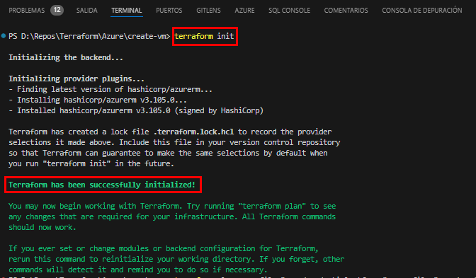
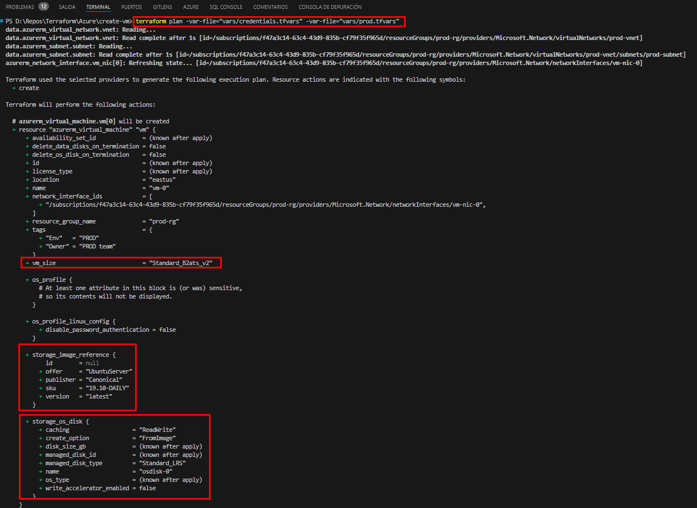
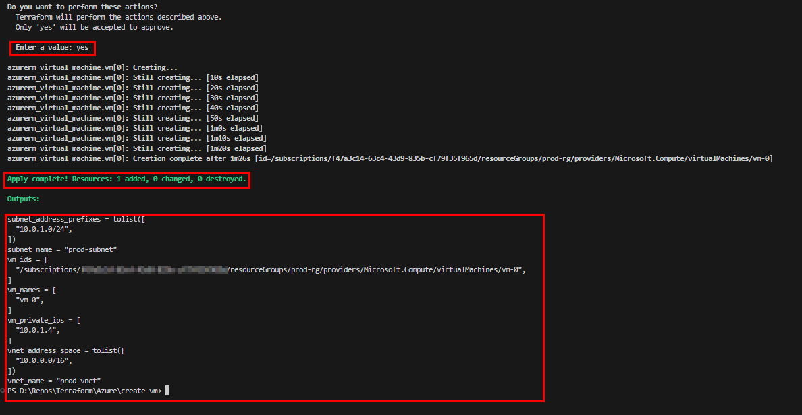
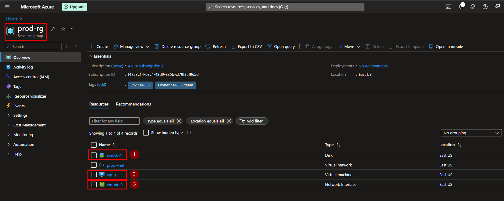
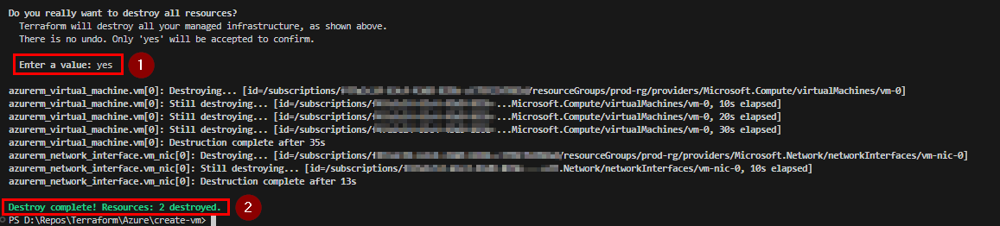
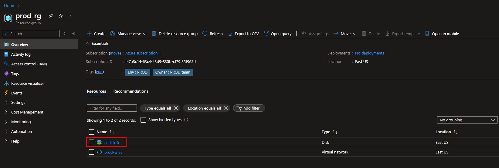

# Terraform Azure Virtual Machine Deployment

This project demonstrates how to use Terraform to create multiple virtual machines (VMs) on Azure. The VMs run Ubuntu 22.04 and are part of a specified virtual network and subnet.

## Project Structure

```
your-terraform-project/
├── create-vm/
│ ├── main.tf
│ ├── variables.tf
│ ├── output.tf
│ ├── README.md
│ ├── vars/
│ │ ├── credentials.tfvars
│ │ ├── dev.tfvars
│ │ ├── prod.tfvars
│ │ └── qa.tfvars
└── ...
```

## Prerequisites

- [Terraform](https://www.terraform.io/downloads.html) installed
- [Azure CLI](https://docs.microsoft.com/en-us/cli/azure/install-azure-cli) installed
- Azure subscription

## Setup

1. **Clone the repository**:

    ```bash
    git clone <repository-url>
    cd your-terraform-project/create-vm
    ```

2. **Configure Azure CLI**:

    Log in to your Azure account and set the subscription:

    ```bash
    az login
    az account set --subscription "<YOUR_SUBSCRIPTION_ID>"
    ```

3. **Create a Service Principal**:

    ```bash
    az ad sp create-for-rbac --name "terraform-sp" --role="Contributor" --scopes="/subscriptions/<YOUR_SUBSCRIPTION_ID>"
    ```

    Save the output containing `appId`, `tenant`, `password`, and `subscriptionId`.

4. **Update `credentials.tfvars`**:

    Add the service principal credentials to `vars/credentials.tfvars`:

    ```hcl
    client_id       = "YOUR_APP_ID"
    client_secret   = "YOUR_CLIENT_SECRET"
    tenant_id       = "YOUR_TENANT_ID"
    subscription_id = "YOUR_SUBSCRIPTION_ID"
    ```

5. **Configure Environment Variables**:

    Update the environment-specific variable files (e.g., `vars/prod.tfvars`):

    ```hcl
    resource_group_name = "prod-rg"
    location            = "East US"
    vnet_name           = "prod-vnet"
    subnet_name         = "prod-subnet"
    admin_username      = "adminuser"
    admin_password      = "Password1234!"
    vm_count            = 3
    vm_publisher        = "Canonical"
    vm_offer            = "UbuntuServer"
    vm_sku              = "22.04-LTS"
    vm_version          = "latest"
    tags = {
        Owner = "PROD team"
        Env   = "PROD"
    }
    ```

## Usage

### Creating the Resource Group

1. **Navigate to the `create-rg` directory**:

    ```bash
    cd ../create-rg
    ```

2. **Initialize Terraform**:

    ```bash
    terraform init
    ```

3. **Plan the Deployment**:

    ```bash
    terraform plan -var-file="vars/credentials.tfvars" -var-file="vars/prod.tfvars"
    ```

4. **Apply the Deployment**:

    ```bash
    terraform apply -var-file="vars/credentials.tfvars" -var-file="vars/prod.tfvars"
    ```

### Creating the Virtual Network

1. **Navigate to the `create-vnet` directory**:

    ```bash
    cd ../create-vnet
    ```

2. **Initialize Terraform**:

    ```bash
    terraform init
    ```

    

3. **Plan the Deployment**:

    ```bash
    terraform plan -var-file="vars/credentials.tfvars" -var-file="vars/prod.tfvars"
    ```

    

4. **Apply the Deployment**:

    ```bash
    terraform apply -var-file="vars/credentials.tfvars" -var-file="vars/prod.tfvars"
    ```

    

### Creating the Virtual Machines

1. **Navigate to the `create-vm` directory**:

    ```bash
    cd ../create-vm
    ```

2. **Initialize Terraform**:

    ```bash
    terraform init
    ```

3. **Plan the Deployment**:

    ```bash
    terraform plan -var-file="vars/credentials.tfvars" -var-file="vars/prod.tfvars"
    ```

4. **Apply the Deployment**:

    ```bash
    terraform apply -var-file="vars/credentials.tfvars" -var-file="vars/prod.tfvars"
    ```

## Outputs

After running `terraform apply`, the following outputs will be displayed:

- **Resource Group**: The name of the created resource group.
- **Virtual Network**: The name and address space of the created virtual network.
- **Subnet**: The name and address prefixes of the created subnet.
- **VM Names**: The names of the created VMs.
- **VM IDs**: The IDs of the created VMs.
- **VM Public IPs**: The public IPs of the created VMs.

## Screenshots

### Terraform Init Output


### Terraform Plan Output


### Terraform Apply Output


### Azure Portal Resource Group content



## Destroying the Infrastructure

To clean up and remove all resources created by Terraform, run the following command from the relevant directory (`create-rg`, `create-vnet`, or `create-vm`):

```bash
terraform destroy -var-file="vars/credentials.tfvars" -var-file="vars/prod.tfvars"
```



### Azure Portal Resource Group content




***Removing Orphaned Disks***
If you have already destroyed the infrastructure and the disk remains, you can manually delete the disk via the Azure portal or using the Azure CLI:

Using Azure CLI:

```bash
az disk list --resource-group prod-rg --output table

Name      ResourceGroup    Location    Zones    Sku           OsType    SizeGb    ProvisioningState
--------  ---------------  ----------  -------  ------------  --------  --------  -------------------
osdisk-0  prod-rg          eastus               Standard_LRS  Linux     30        Succeeded


az disk delete --resource-group your_resource_group --name your_disk_name --yes
az disk delete --resource-group prod-rg --name osdisk-0 --yes

```
